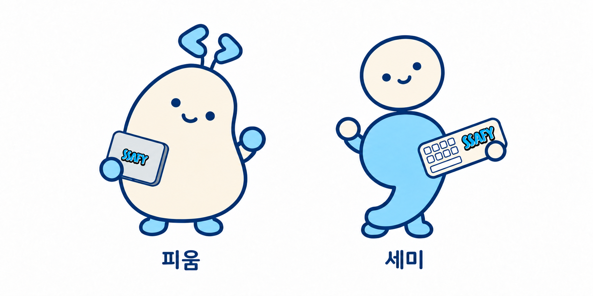

# SSAFY Character — 피움 · 세미

SSAFY 캐릭터 공모전을 위해 제작한 **피움**과 **세미**의 기본 디자인, 응용형, 스토리라인과 AI 제작 과정을 정리한 비공개 작업 저장소입니다.

## 기본형



캐릭터별 기본형: [피움 PNG](assets/pium-basic.png) · [세미 PNG](assets/semi-basic.png) — 각각 887 × 887, 흰 배경과 이름 포함. 기존 비교 이미지를 좌우로 분리한 파일입니다.

| 캐릭터 | 이름의 의미 | 스토리 |
|---|---|---|
| **피움** | 가능성을 피우다 | SSAFY에서 배움과 협업으로 성장하는 작은 코드 씨앗 |
| **세미** | 세미콜론 `;` | 교육생과 함께 질문하고 시도하며 배우는 작은 AI 동료 |

피움은 코드 기호를 닮은 두 새싹과 노트북을, 세미는 세미콜론 실루엣과 키보드를 특징으로 합니다. 소품에는 사용자가 제공한 SSAFY 의류 로고를 참고한 글자를 적용했습니다.

**[캐릭터 이름·스토리·디자인 의미 자세히 보기 →](docs/storyline.md)**

## 응용형 1차 시안

각 캐릭터에 **활짝 웃기 / 열정 코딩 / 유레카! / 잠깐 충전** 총 4가지 응용형을 제작했습니다. 기존 3종은 캐릭터별 비교 시트, 추가한 ‘잠깐 충전’은 개별 PNG입니다.

### 피움


### 세미


### 추가 응용형 — 잠깐 충전

| 피움 | 세미 |
|---|---|
|  |  |
| 작은 노트북 앞에서 꾸벅 조는 모습 | 키보드를 품에 안고 편안하게 쉬는 모습 |

각각 1254 × 1254 PNG이며, 흰 배경과 ‘잠깐 충전’ 캡션을 포함합니다.

- **활짝 웃기:** 두 팔을 벌리고 반가움과 친근함 표현.
- **열정 코딩:** 노트북·키보드를 두드리는 동작과 불꽃으로 학습 열정 표현.
- **유레카!:** 전구와 반짝임, 기쁜 동작으로 문제 해결의 순간 표현.
- **잠깐 충전:** 공부 중 잠시 쉬어가는 모습으로 친근함과 여유 표현.

**[응용형 구성과 제작 상태 →](docs/applications.md)**

## 제작 방식과 프롬프트

사용 도구는 **ChatGPT(Codex)의 내장 이미지 생성·편집 도구**인 `image_gen`입니다. 사용자의 아이디어와 피드백을 바탕으로 어시스턴트가 도구 입력 프롬프트를 작성했고, 초기 생성 뒤 기존 이미지와 로고 참고 자료를 입력해 반복 수정했습니다.

- [기본형 생성·수정 프롬프트 원문 — 7단계](prompts/basic-generation.md)
- [응용형 생성 프롬프트 원문 — 캐릭터별 3종](prompts/application-generation.md)
- [추가 응용형 ‘잠깐 충전’ 프롬프트 원문](prompts/recharge-generation.md)
- [제작 과정과 최종 반영 사항](docs/production-log.md)
- [이미지 크기·SHA-256 기록](assets/manifest.json)

구체적인 이미지 모델명은 도구 반환값에서 확인되지 않아 기재하지 않았습니다. SSAFY 로고는 원본 벡터를 직접 합성한 결과가 아니라 제공 이미지를 참고한 AI 재현입니다.

## 현재 상태

| 항목 | 상태 |
|---|---|
| 피움·세미 기본형 | 현재 확정본 저장 |
| 이름·스토리·디자인 의미 | 문서 정리 완료 |
| 각 캐릭터 응용형 4종 | 기존 3종 비교 시트 + 잠깐 충전 개별 시안 |
| 실제 사용한 프롬프트 | 원문과 단계별 참조 기록 저장 |
| 기본형 개별 PNG | 피움·세미 분리 완료 |
| 잠깐 충전 개별 PNG | 피움·세미 각각 저장 |
| 기존 응용형 3종 포즈별 분리·투명 배경 | 미제작 |
| 응용형 최종 확정·공모전 제출 | 미완료 |

캐릭터 스토리는 공모전 출품을 위한 창작 설정이며, SSAFY의 공식 캐릭터 설정이 아닙니다. 이 저장소에는 별도 재사용 라이선스를 부여하지 않았습니다.

## 폴더 구조

```text
assets/
  basic.png                    기본형 비교 이미지
  pium-basic.png               피움 기본형 개별 이미지
  semi-basic.png               세미 기본형 개별 이미지
  pium-actions-v1.png           피움 응용형 3종
  semi-actions-v1.png           세미 응용형 3종
  pium-recharge-v1.png          피움 잠깐 충전 개별 이미지
  semi-recharge-v1.png          세미 잠깐 충전 개별 이미지
  manifest.json                이미지 크기와 해시
docs/
  storyline.md                 이름·스토리·성격·디자인 의미
  applications.md              응용형 설명
  production-log.md            제작 이력
prompts/
  basic-generation.md          실제 기본형 프롬프트
  application-generation.md    실제 응용형 프롬프트
  recharge-generation.md       잠깐 충전 프롬프트
```
