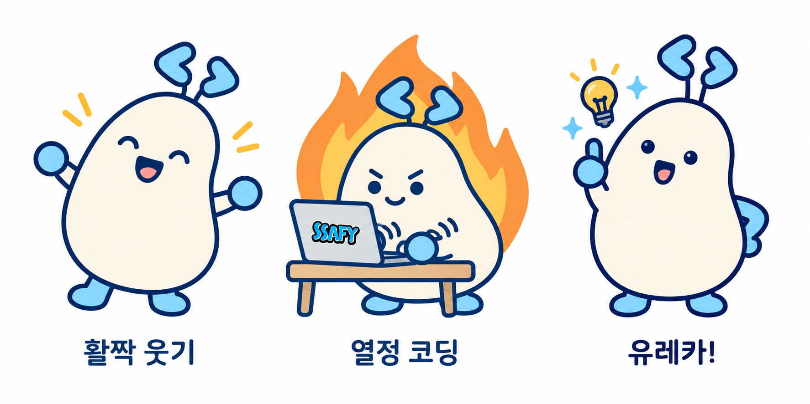
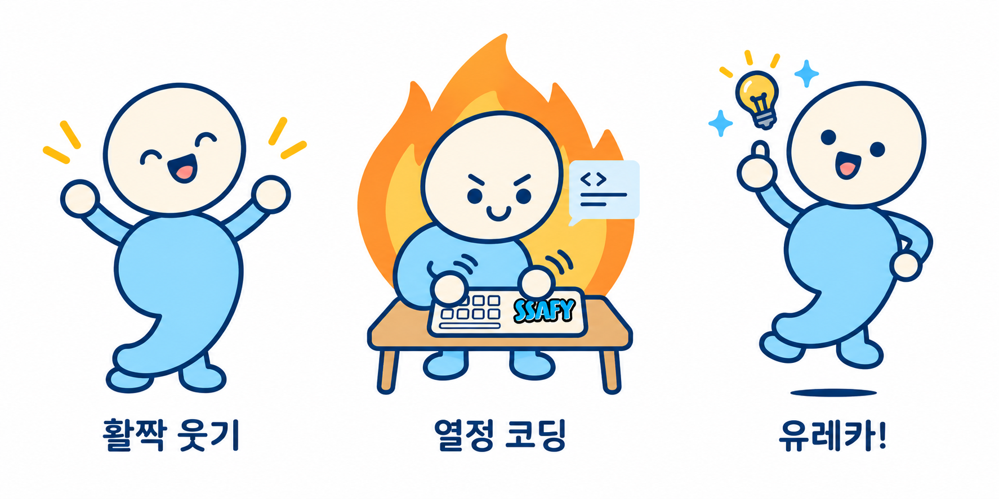
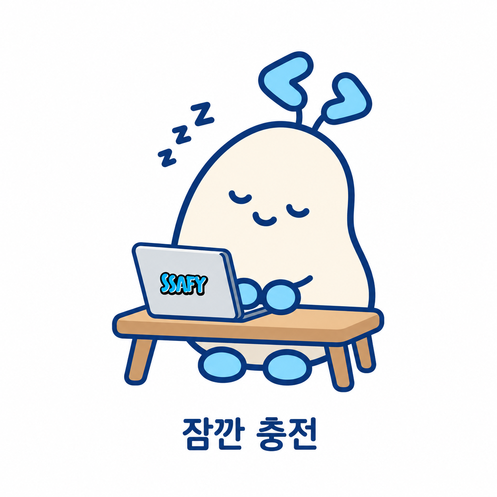
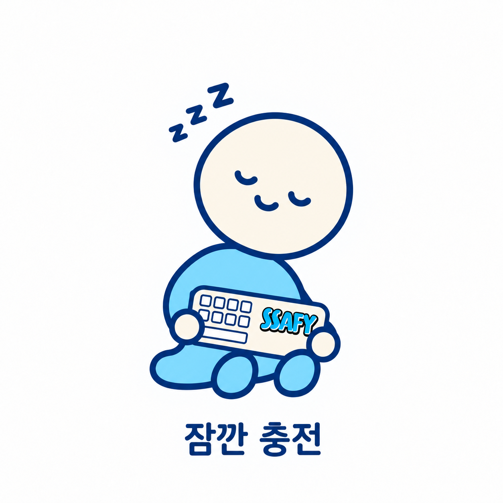

# 피움 · 세미 응용형 1차 시안

두 캐릭터의 기본형을 기준으로, 각각 같은 주제의 응용형 4종을 제작했습니다. 기존 3종은 비교 시트에 담았고, 네 번째 ‘잠깐 충전’은 캐릭터별 개별 PNG로 저장했습니다. 모두 검토용 1차 시안이며 흰 배경입니다.

## 피움

1. **활짝 웃기:** 두 팔을 벌리고 눈웃음과 크게 웃는 입으로 환영과 친근함을 표현합니다.
2. **열정 코딩:** 작은 책상 위의 열린 노트북을 열심히 두드리는 장면입니다. 집중한 표정, 손 주변 동작선과 불꽃이 배움의 열정을 나타냅니다.
3. **유레카!:** 손을 들고 아이디어를 발견한 순간을 표현합니다. 두 새싹, 전구와 반짝임으로 깨달음의 기쁨을 더했습니다.

## 세미

1. **활짝 웃기:** 두 팔을 벌려 반갑게 웃는 모습입니다.
2. **열정 코딩:** 책상 위 키보드를 두드리며 집중합니다. 불꽃, 손 동작선과 작은 코드 말풍선이 코딩 중인 상황을 강조합니다.
3. **유레카!:** 한 손을 들고 가볍게 뛰는 동작에 전구와 반짝임을 더해 문제 해결의 성취감을 표현합니다.

## 제안 및 제작 과정

### 네 번째 응용형 — 잠깐 충전

| 피움 | 세미 |
|---|---|
|  |  |

- **피움:** 작은 책상과 열린 회색 노트북 앞에서 눈을 감고 꾸벅 조는 모습입니다. 기울어진 새싹과 작은 잠 표시로 쉬는 장면을 표현합니다.
- **세미:** 작은 키보드를 품에 안고 앉아 고개를 기울여 쉬는 모습입니다. 원형 머리와 쉼표 몸통을 유지하며 편안함을 표현합니다.
- **의도:** 열정 코딩 장면과 함께 사용할 수 있도록, 노력하는 교육생이 잠시 쉬어가는 일상을 담았습니다. 네 번째 주제는 어시스턴트가 제안했습니다.
- **파일:** 각 1254 × 1254 PNG, 흰 배경과 ‘잠깐 충전’ 캡션 포함.
- **생성 참조:** 피움은 피움 기본형을, 세미는 세미 기본형과 피움의 새 응용형을 함께 참조했습니다.

[잠깐 충전 실제 생성 프롬프트](../prompts/recharge-generation.md)

### 기존 3종 제작

첫 두 주제는 사용자가 제안했고, 세 번째 ‘유레카!’는 문제 해결의 순간을 보여주기 위해 어시스턴트가 제안했습니다. 불꽃은 열정을 나타내는 만화적 배경 효과입니다.

기본형의 크림색·하늘색 조합과 남색 외곽선, 피움의 두 코드 새싹, 세미의 원형 머리와 쉼표 몸통을 참고했습니다. 피움 시안을 먼저 만든 뒤 세미에는 기본형과 피움 응용 시트를 함께 입력해 그림체·캡션·효과 구성을 맞췄습니다.

각 시트의 세 가지 동작, 캐릭터 구분, 캡션과 주요 효과를 시각적으로 확인했습니다. 포즈에 따른 세부 비율과 소품은 AI로 다시 그린 결과이며 기본형과 픽셀 단위로 동일한 것은 아닙니다.

## 남은 작업

- 응용형의 표정·동작·소품 세부 디자인 피드백 반영.
- 최종 선택 후 기존 3종의 포즈별 개별 PNG 분리와 필요한 이미지의 투명 배경 출력.
- 제출용 이미지 구성과 이름·스토리 문서 최종 정리.

[실제 응용형 프롬프트](../prompts/application-generation.md) · [기본형](../assets/basic.png) · [저장소 첫 화면](../README.md)
